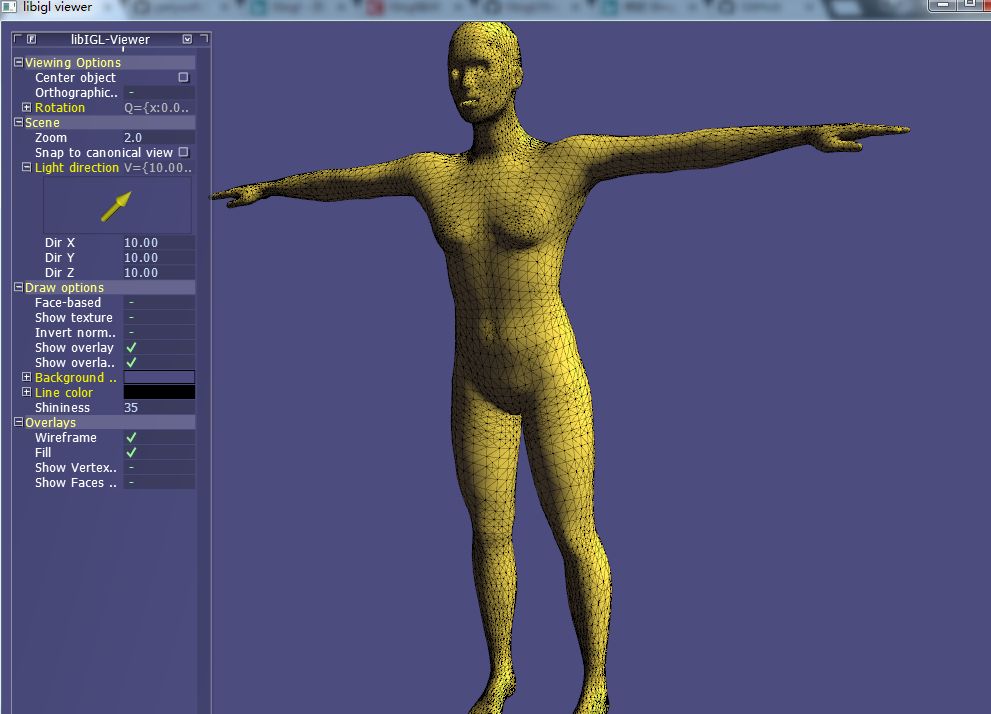

# Human
visualize 3D human body with libigl

This project describe an implementation to visualize 3D human body model created by other 3D tools, and it is implemented using visual studio. All depedencies are included in the .sln file. Please see the projects for details.

An example are shown in 

